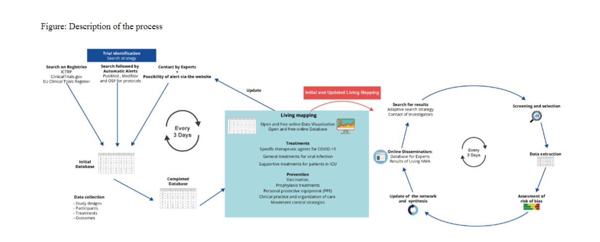

```{r setup, include=FALSE}
options(htmltools.dir.version = FALSE)
library(here) 
```

class: inverse

# Outline of the talk

## What is Evidence Synthesis?
  - Methods & concepts

## What are the challenges?
  - (...some of the challenges)
  - And some solutions

## What are the opportunities?
  - Research
  - "Easy" win for NINA?

---
class: inverse, center, middle

# What is evidence synthesis?

"‘Evidence synthesis’ refers to the process of bringing together information from a range of sources and disciplines to inform debates and decisions on specific issues. Decision-making and public debate are best served if policymakers have access to the best current evidence on an issue. An accurate, concise and unbiased synthesis of the evidence is therefore one of the most valuable contributions the research community can offer policymakers." (Royal Society)

---

# Evidence synthesis approaches #1

**Systematic map (a.k.a. scoping review)**
- It shows where there are data "gaps" (where we need primary research) and data gluts (where we need systematic review)


```{r, echo=FALSE, warning=FALSE, message=FALSE}
img3_path=paste0(here(),"/assets/SystematicMap.png")
knitr::include_graphics(img3_path)

```

---

# Evidence synthesis approaches #2

**Systematic review** 
- Methodological approach designed to reduce bias in reviews of literature around a narrow question 
- Not just a review done systematically


```{r, echo=FALSE, warning=FALSE, message=FALSE}
img3_path=paste0(here(),"/assets/SystematicReview.png")
knitr::include_graphics(img3_path)

```

---

# Evidence synthesis approaches #3

**Meta-analysis**
- Statistical model to bring together *effect size estimates* from a number of discrete studies
- Yes, it is "just regression"
```{r, echo=FALSE, warning=FALSE, message=FALSE, out.height= "400"}
img3_path=paste0(here(),"/assets/That-jerk-throwing-weight.jpg")
knitr::include_graphics(img3_path)

```


---
# An aside - what is an effect size?

The effect size is the standardised difference between two groups. 

<iframe src="https://drmatt.shinyapps.io/Dance_of_p/?_ga=2.106381763.1562201692.1601905231-1918338439.1553066524"width="90%" height="70%" ></iframe>


---
# Evidence synthesis approaches #4

**Decision model**
- Any model that contextualises the evidence in a form designed to help inform decisions

```{r, echo=FALSE, warning=FALSE, message=FALSE}
img3_path=paste0(here(),"/assets/DecisionModel.png")
knitr::include_graphics(img3_path)

```

---

# Challenges in Evidence synthesis #1
*Huge numbers of papers*

Over 2.5 million academic papers published per year 


### Solutions
- Evidence mapping (open access tools - e.g. EviAtlas, sysrevdata)
- Dynamic searching (e.g. litsearchr, Revtools)
- Research weaving*
- Collaborative synthesis
- Living systematic reviews*
- "Robot" data extraction* (e.g. doi2txt)

---
## Research weaving


---
## Living Systematic Reviews



---
```{r, echo=FALSE}
knitr::include_url("https://covid-nma.com/dataviz/", height = "400px")

```
---
## "Robot" data extraction

- Data extraction using Natural Language Processing (NLP) algorithms 
- It's a bit easier in medicine and other sciences with well defined reporting standards
- Although we (Eliza Grimes; Neal Haddaway; Gabby Palomo-Munoz; Me) have started to do this for ecological journals

```{r, echo=FALSE, warning=FALSE, message=FALSE,out.width = "200px"}
img3_path=paste0(here(),"/assets/logo.png")
knitr::include_graphics(img3_path)

```

---
# Challenges in Evidence synthesis #2
**Inconclusive evidence**

```{r, echo=FALSE, warning=FALSE, message=FALSE,out.width = "400px"}
# Small fig.width

img1_path=paste0(here(),"/assets/Buck.jpg")
knitr::include_graphics(img1_path)

```

---

# What are the opportunities? #1

Decision analysis added to Evidence Synthesis


---


```{r, echo=FALSE, warning=FALSE, message=FALSE}


img1_path=paste0(here(),"/assets/jfr312484-fig-0002-m.png")
img2_path=paste0(here(),"/assets/jfr312484-fig-0004-m.jpg")
knitr::include_graphics(img1_path)

```

---

```{r, echo=FALSE, warning=FALSE, message=FALSE}

#img1_path=paste0(here(),"/assets/jfr312484-fig-0002-m.png")
img2_path=paste0(here(),"/assets/jfr312484-fig-0004-m.jpg")
knitr::include_graphics(img2_path)
```

---

# What are the opportunities? #2

*Network Meta-analysis - difference between interventions*

```{r, echo=FALSE, warning=FALSE, message=FALSE}

#img1_path=paste0(here(),"/assets/jfr312484-fig-0002-m.png")
img2_path=paste0(here(),"/assets/unnamed-chunk-309-1.png")
knitr::include_graphics(img2_path)
```

---

```{r, echo=FALSE, warning=FALSE, message=FALSE}

#img1_path=paste0(here(),"/assets/jfr312484-fig-0002-m.png")
img2_path=paste0(here(),"/assets/forest_bayesian.png")
knitr::include_graphics(img2_path)
```

---

## An "easy" win?

<blockquote class="twitter-tweet"><p lang="en" dir="ltr">Does your organisation have online reports (in any language) some of which test whether conservation actions work? Are you prepared to extract such reports so they are available to a wider audience and included in evidence synthesis? Please get in touch! <a href="https://t.co/zeksXCDsK1">https://t.co/zeksXCDsK1</a></p>&mdash; Bill Sutherland (@Bill_Sutherland) <a href="https://twitter.com/Bill_Sutherland/status/1316289266742427648?ref_src=twsrc%5Etfw">October 14, 2020</a></blockquote> <script async src="https://platform.twitter.com/widgets.js" charset="utf-8"></script>

---
class: inverse

# Some final points

## Evidence synthesis is a robust methodology but it can be done badly
## Often evidence synthesis can come across as rigid and unforgiving
## "Rapid synthesis" is a bit of a buzzword at the moment but we can do reviews rapidly 


---

```{r, echo=FALSE, warning=FALSE, message=FALSE}

#img1_path=paste0(here(),"/assets/jfr312484-fig-0002-m.png")
img2_path=paste0(here(),"/assets/1500x500.jpg")
knitr::include_graphics(img2_path)
```

## Have a look at some of the tools we are developing at https://www.eshackathon.org/
